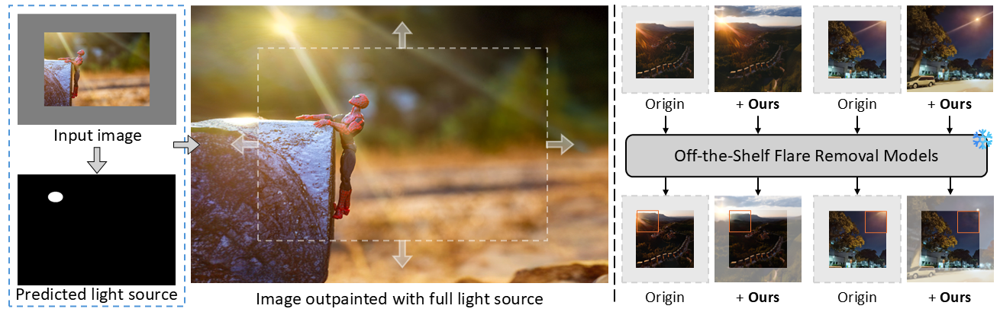

# LightsOut: Diffusion-based Outpainting for Enhanced Lens Flare Removal

[Shr-Ruei Tsai](), [Wei-Cheng Chang](), [Jie-Ying Lee](https://jayinnn.dev/), [Chih-Hai Su](), [Yu-Lun Liu](https://yulunalexliu.github.io/)

National Yang Ming Chaio Tung University

<!-- [](https://arxiv.org/) -->



## Dataset Preparation

## Environment Setup
```
conda create -n lightsout python=3.9
conda activate lightsout
pip install -r requirements.txt
```

## Training

## Inference

## Citation
```
@InProceedings{,
  author    = {},
  title     = {},
  booktitle = {},
  month     = {},
  year      = {},
  pages     = {}
}
```

## Acknowledgements
This research was funded by the National Science and Technology Council, Taiwan, under Grants NSTC 112-2222-E-A49-004-MY2 and 113-2628-E-A49-023-. The authors are grateful to Google, NVIDIA, and MediaTek Inc. for their generous donations. Yu-Lun Liu acknowledges the Yushan Young Fellow Program by the MOE in Taiwan.